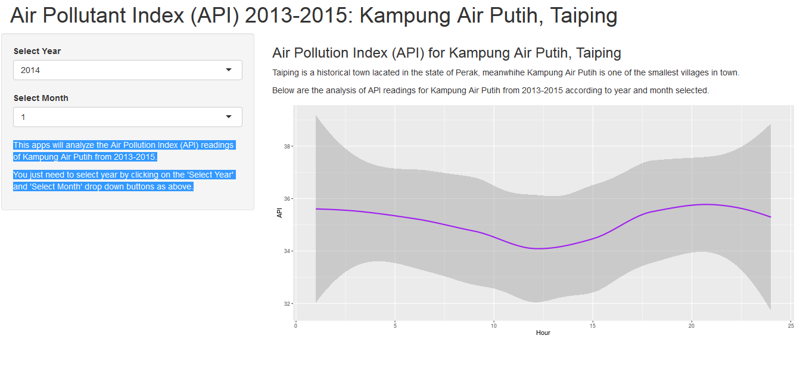

Module 9 Developing Data Products: Assignment
========================================================
Author: Ashara Banu binti Mohamed
Date: 31 January 2016


Project Detail
========================================================
This apps will analyze the Air Pollution Index (API) readings of Kampung Air Putih from 2013-2015. You just need to select year by clicking on the 'Select Year' and 'Select Month' drop down buttons as above. This assignment has two parts

A) Shiny Apps
1) The apps can be viewed at https://sharabanu.shinyapps.io/TaipingApi/

B) Reproducible Pitch Presentation
1. Presentation pushed to Rpubs


Data used for the assignment
========================================================

```r
 taiping<-read.csv("taiping.csv")
 str(taiping)
```

```
'data.frame':	13295 obs. of  6 variables:
 $ Station.No: int  19 19 19 19 19 19 19 19 19 19 ...
 $ Location  : Factor w/ 1 level "Kg. Air Putih, Taiping": 1 1 1 1 1 1 1 1 1 1 ...
 $ Date      : Factor w/ 554 levels "2013-08-01","2013-08-02",..: 1 1 1 1 1 1 1 1 1 1 ...
 $ Hour      : int  2 3 4 5 6 7 8 9 10 11 ...
 $ API       : int  53 53 53 53 53 52 51 51 51 50 ...
 $ Pollutant : Factor w/ 4 levels "*","0","a","c": 1 1 1 1 1 1 1 1 1 1 ...
```

Slide With Plot
========================================================
Input and output field of the assignment




Thank You
========================================================
This assignment contains all the code and data making up this solution. The files and folders are the following:

- README.md
- ui.R and server.R - The shiny app code
- /project - The R Markdown used to create the RStudio Presenter presentation.
